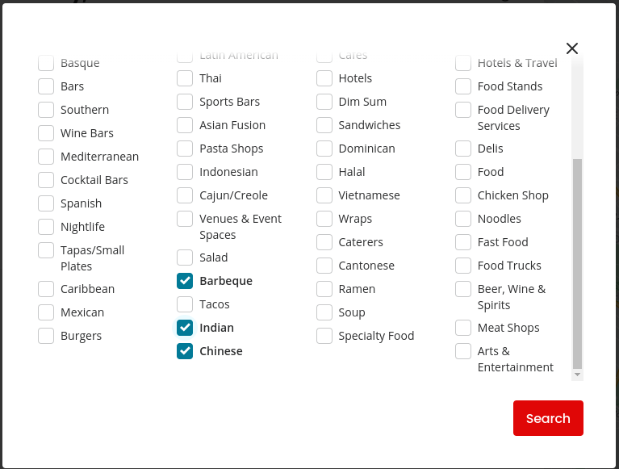

# Homework 4 — Implementing a Simple Yelp

In this assignment you will implement a simple business review and recommendation system called New York Businesses. Your program will mimic some behaviors of Yelp. Please read the entire handout before starting to code the assignment.

## Learning Objectives

- Get familiar with a commonly used data structure - linked lists.
- Practice using std::list.
- Practice using iterators.

## Background

Yelp is a popular online platform and mobile application that allows users to discover and review local businesses, particularly restaurants. It provides a platform for users to share their experiences and opinions about various businesses, including restaurants, bars, cafes, and other services. 

In this assignment, you will be implement a program which allows users to discover local businesses.


## Specification

## Input Files

## Commands to Support & Program Output

Your program only needs to support the following command:

```console
nybusninesses.exe input.json output.txt zipcode categories
```

Here

- input.json is the input file. In this assignment, we have several input files, but for each run of your program, it takes one input file.
- output.txt is where to print your output.
- zipcode indicates the zipcode of the area where the user is trying to search.
- categories indicate the categories of the businesses. This argument can be one or multiple of the following:




Keep in mind that users can select multiple categories, in the above two screenshots, six categories were chosen, and they are:

- Pizza
- Sushi Bars
- Japanese
- Barbeque
- Indian
- Chinese

If multiple categories are supplied from the command line, these categories will be separated by a single space.

When your program is executed, it produces the businesses which fall into any of the chosen categories, and are located in this zipcode area. For each business, your program will print to the output file something similar to what Yelp does. The following is an example:


The businesses showed in your output file should be sorted based on the rating of the business, with higher rated businesses being showed before lower rated businesses. For any two businesses which have the same rating, for example, both are 4.5, then in your output file, keep the order of these two as they appear in the input file.

## Provided Code

Several helper functions are provided for you to parse the json file. All of them expect the caller to provide the one line from the json file as the sole argument, in the format of an std::string.

1. Get Business Name:

```cpp
std::string getName(std::string& line){
        int start = 0;
        // starting from the position start, and search the string variable line,
        // to find the first name string.
        int key_start = line.find("name", start);
        int value_start = key_start + 7;
        // remind them to use escape.
        int value_end = line.find("\"", value_start);
        int len = value_end - value_start;
        // go from start to end, but exclude the character at end.
        // when we use the substr(start, length) function on a std::string,
        // the substring includes the character at the start position,
        // and the length of the substring is length.
        // It does not include the character at the position start + length.
        std::string name = line.substr(value_start, len);
        return name;
}
```

2. Get Categories:

```cpp
std::string getCategories(std::string& line){
        int start = 0;
        // starting from the position start, and search the string variable line,
        // to find the first categories string.
        int key_start = line.find("categories", start);
        int value_start = key_start + 13;
        // remind them to use escape.
        int value_end = line.find("\"", value_start);
        int len = value_end - value_start;
        // go from start to end, but exclude the character at end.
        // when we use the substr(start, length) function on a std::string,
        // the substring includes the character at the start position,
        // and the length of the substring is length.
        // It does not include the character at the position start + length.
        std::string categories = line.substr(value_start, len);
        return categories;
}
```

3. Get Rating:

```cpp
double getRating(std::string& line){
        int start = 0;
        // starting from the position start, and search the string variable line,
        // to find the first stars string.
        int key_start = line.find("stars", start);
        int value_start = key_start + 7;
        // remind them to use escape.
        int value_end = line.find("\"", value_start);
        // -1 here because this is not a string.
        int len = value_end - value_start - 1;
        // go from start to end, but exclude the character at end.
        // when we use the substr(start, length) function on a std::string,
        // the substring includes the character at the start position,
        // and the length of the substring is length.
        // It does not include the character at the position start + length.
        // convert this string to a double
        double stars = stod(line.substr(value_start, len));
        return stars;
}
```

4. Get Price Level:

```cpp
int getPrice(std::string& line){
        int start = 0;
        // starting from the position start, and search the string variable line,
        // to find the first RestaurantsPriceRange2 string.
        int key_start = line.find("RestaurantsPriceRange2", start);
        // if not found, return now
        if(key_start == std::string::npos){
                return -1;
        }
        int value_start = key_start + 25;
        // remind them to use escape.
        int value_end = line.find("\"", value_start);
        // -1 here because this is not a string.
        int len = value_end - value_start;
        // go from start to end, but exclude the character at end.
        // when we use the substr(start, length) function on a std::string,
        // the substring includes the character at the start position,
        // and the length of the substring is length.
        // It does not include the character at the position start + length.
        // convert this string to an integer
        int price = stoi(line.substr(value_start, len));
        return price;
}
```

## Program Requirements & Submission Details

In this assignment, **you must use std::list to store the businesses which match with what the user is searching for**. 

Use good coding style when you design and implement your program. Organize your program into functions: don’t put all the code in main! Be sure to read the [Homework Policies](https://www.cs.rpi.edu/academics/courses/spring24/csci1200/homework_policies.php) as you put the finishing touches on your solution. Be sure to make up new test cases to fully debug your program and don’t forget
to comment your code! Use the provided template [README.txt](./README.txt) file for notes you want the grader to read.
You must do this assignment on your own, as described in the [Collaboration Policy & Academic Integrity](https://www.cs.rpi.edu/academics/courses/spring24/csci1200/academic_integrity.php) page. If you did discuss the problem or error messages, etc. with anyone, please list their names in your README.txt file. 

**Due Date**: 02/15/2024, Thursday, 22:00pm.

## Rubric

