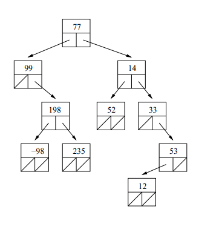
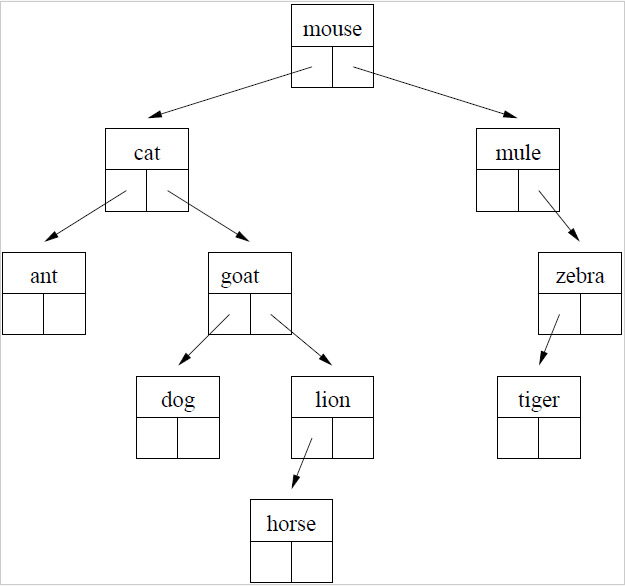
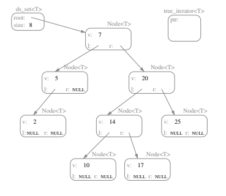

# Lecture 17 --- Trees, Part I

## Review from Lecture 16

- STL set container class (like STL map, but without the pairs!)
- set iterators, insert, erase, find

## Today’s Lecture

- Binary trees, binary search trees
- Implementation of ds_set class using binary search trees
- In-order, pre-order, and post-order traversal

## Overview: Lists vs Trees vs Graphs
- Trees create a hierarchical organization of data, rather than the linear organization in linked lists (and arrays and vectors).
- Binary search trees are the mechanism underlying maps & sets (and multimaps & multisets).
- Mathematically speaking: A _graph_ is a set of vertices connected by edges. And a tree is a special graph that has no _cycles_. The edges that connect nodes in trees and graphs may be _directed_ or _undirected_.

## 17.1 Definition: Binary Trees

- A binary tree (strictly speaking, a “rooted binary
tree”) is either empty or is a node that has
pointers to two binary trees.
- Here’s a picture of a binary tree storing integer
values. In this figure, each large box indicates a
tree node, with the top rectangle representing the
value stored and the two lower boxes representing
pointers. Pointers that are null are shown with a
slash through the box.



- The topmost node in the tree is called the root.
- The pointers from each node are called left and
right. The nodes they point to are referred to as
that node’s (left and right) children.
- The (sub)trees pointed to by the left and right
pointers at any node are called the left subtree
and right subtree of that node.
- A node where both children pointers are null is
called a leaf node.
- A node’s parent is the unique node that points to
it. Only the root has no parent.

## 17.2 Definition: Binary Search Trees

- A binary search tree (often abbreviated to
BST) is a binary tree where at each node
of the tree, the value stored at the node is
  – greater than or equal to all values
stored in the left subtree, and

  – less than or equal to all values stored in
the right subtree.

- Here is a picture of a binary search tree
storing string values.



## 17.3 Definition: Balanced Trees

- The number of nodes on each subtree of each node in a
“balanced” tree is approximately the same. In order to
be an exactly balanced binary tree, what must be true
about the number of nodes in the tree?
- In order to claim the performance advantages of trees, we must assume and ensure that our data structure
remains approximately balanced. (You’ll see much more of this in Intro to Algorithms!)

## 17.4 Exercise

Consider the following values:
4.5, 9.8, 3.5, 13.6, 19.2, 7.4, 11.7

1. Draw a binary tree with these values that is NOT a binary search tree.

2. Draw two different binary search trees with these values. Important note: This shows that the binary search
tree structure for a given set of values is not unique!

3. How many exactly balanced binary search trees exist with these numbers? How many exactly balanced
binary trees exist with these numbers?

## 17.5 Beginning our implementation of ds_set: The Tree Node Class

- Here is the class definition for nodes in the tree. We will use this for the tree manipulation code we write.

```cpp
template <class T> class TreeNode {
public:
	TreeNode() : left(NULL), right(NULL) {}
	TreeNode(const T& init) : value(init), left(NULL), right(NULL) {}
	T value;
	TreeNode* left;
	TreeNode* right;
};
```

- Note: Sometimes a 3rd pointer — to the parent TreeNode — is added.

## 17.6 Exercises

1. Write a templated function to find the smallest value stored in a binary search tree whose root node is pointed
to by p.

2. Write a function to count the number of odd numbers stored in a binary tree (not necessarily a binary search
tree) of integers. The function should accept a TreeNode<int> pointer as its sole argument and return an
integer. Hint: think recursively!

## 17.7 ds_set and Binary Search Tree Implementation

- A partial implementation of a set using a binary search tree is provided in this [ds_set_starter.h](ds_set_starter.h). We will continue to study this implementation in Lab 10 & the next lecture.
- The increment and decrement operations for iterators have been omitted from this implementation. Next week
in lecture we will discuss a couple strategies for adding these operations.
- We will use this as the basis both for understanding an initial selection of tree algorithms and for thinking
about how standard library sets really work.

## 17.8 ds_set: Class Overview

- There is two auxiliary classes, TreeNode and tree_iterator. All three classes are templated.
- The only member variables of the ds_set class are the root and the size (number of tree nodes).
- The iterator class is declared internally, and is effectively a wrapper on the TreeNode pointers.
  – Note that operator* returns a const reference because the keys can’t change.

  – The increment and decrement operators are missing (we’ll fill this in next week in lecture!).

- The main public member functions just call a private (and often recursive) member function (passing the root
node) that does all of the work.
- Because the class stores and manages dynamically allocated memory, a copy constructor, operator=, and
destructor must be provided.



## 17.9 Exercises

1. Provide the implementation of the member function ds_set<T>::begin. This is essentially the problem of
finding the node in the tree that stores the smallest value.


2. Write a recursive version of the function find.

## 17.10 In-order, Pre-Order, Post-Order Traversal

- One of the fundamental tree operations is “traversing” the nodes in the tree and doing something at each node.
The “doing something”, which is often just printing, is referred to generically as “visiting” the node.
- There are three general orders in which binary trees are traversed: pre-order, in-order and post-order.
 In order to explain these, let’s first draw an “exactly balanced” binary search tree with the elements 1-7:

  – What is the in-order traversal of this tree? Hint: it is monotonically increasing, which is always true for
an in-order traversal of a binary search tree!


  – What is the post-order traversal of this tree? Hint, it ends with “4” and the 3rd element printed is “2”.


  – What is the pre-order traversal of this tree? Hint, the last element is the same as the last element of the
in-order traversal (but that is not true in general! why not?)

