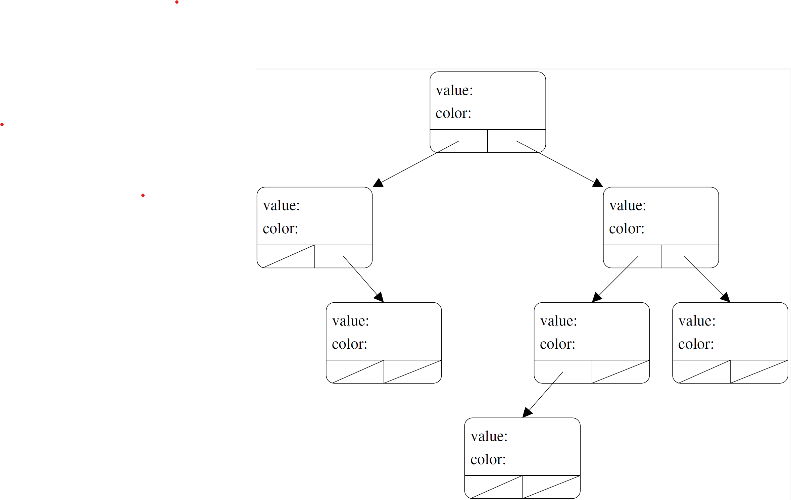

# Lecture 21 --- Trees, Part IV

Review from Lecture 19
- Breadth-first and depth-first tree search
- Increement/decrement operator
- Tree height, longest-shortest paths, breadth-first search
- Last piece of ds_set: removing an item, erase
- Erase with parent pointers, increment operation on iterators
- Limitations of our ds set implementatioN

## Today’s Lecture

- Red Black Trees
- B+ Trees

## 21.1 Red-Black Trees
In addition to the binary search tree properties, the following 
red-black tree properties are maintained throughout all 
modifications to the data structure:

- Each node is either red or black.
- The NULL child pointers are black.
- Both children of every red node are black.
- Thus, the parent of a red node must also be black.
- All paths from a particular node to a NULL child pointer contain the same
  number of black nodes.


What tree does our **ds_set** implementation produce if we insert the
numbers 1-14 **in order**?

The tree at the right is the result using a red-black tree.  Notice how the tree is still quite balanced.  

Visit these links for an animation of the sequential insertion and re-balancing:

http://babbage.clarku.edu/~achou/cs160fall03/examples/bst_animation/RedBlackTree-Example.html

https://www.cs.usfca.edu/~galles/visualization/RedBlack.html

http://www.youtube.com/watch?v=vDHFF4wjWYU&noredirect=1

What is the best/average/worst case height of a red-black tree with $n$ nodes?

&nbsp;
&nbsp;
&nbsp;
&nbsp;
&nbsp;
&nbsp;

What is the best/average/worst case shortest-path from root to leaf node in a red-black tree with $n$ nodes?

&nbsp;
&nbsp;
&nbsp;
&nbsp;
&nbsp;
&nbsp;

## Exercise 21.2
Fill in the tree on the right with the integers 1-7 to make a binary search tree.  Also, color each node "red" or "black" so that the tree also fulfills the requirements of a Red-Black tree. 



Which nodes are red?

**Note:** Red-Black Trees are just one algorithm for **self-balancing binary search tress**. We have many more, including the AVL trees that we discussed last week.

## 21.3 Trinary Tree

A  **trinary tree** is similar to a binary tree except that each node has at most 3 children.  Write a **recursive** function named **EqualsChildrenSum** that takes one argument, a pointer to the root of a trinary tree, and returns true if the value at each non-leaf node is the sum of the values of all of its children and false otherwise.  In
the examples below, the tree on the left will return true and the tree on the right will return false.

```cpp
class Node {
  public:
    int value;
    Node* left;
    Node* middle;
    Node* right;
  };
```


## 21.4 B+ Trees

Unlike binary search trees, nodes in B+ trees (and their predecessor, the B tree) have up to b children. Thus
B+ trees are very flat and very wide. This is good when it is very expensive to move from one node to another.
- B+ trees are supposed to be associative (i.e. they have key-value pairs), but we will just focus on the keys.
- Just like STL map and STL set, these keys and values can be any type, but keys must have an operator<
defined.
- In a B tree key-value pairs can show up anywhere in the tree, in a B+ tree all the key-value pairs are in the
leaves and the non-leaf nodes contain duplicates of some keys.
- In either type of tree, all leaves are the same distance from the root.
- The keys are always sorted in a B/B+ tree node, and there are up to b − 1 of them. They act like b − 1 binary
search tree nodes mashed together.
- In fact, with the exception of the root, nodes will always have between roughly b/2 and b − 1 keys (in our
implementation).
- If a B+ tree node has k keys key0, key1, key2, . . . , keyk−1, it will have k + 1 children. The keys in the leftmost
child must be < key0, the next child must have keys such that they are ≥key0 and < key1, and so on up to
the rightmost child which has only keys ≥keyk−1.

A B+ tree visualization can be seen at: https://www.cs.usfca.edu/~galles/visualization/BPlusTree.html


